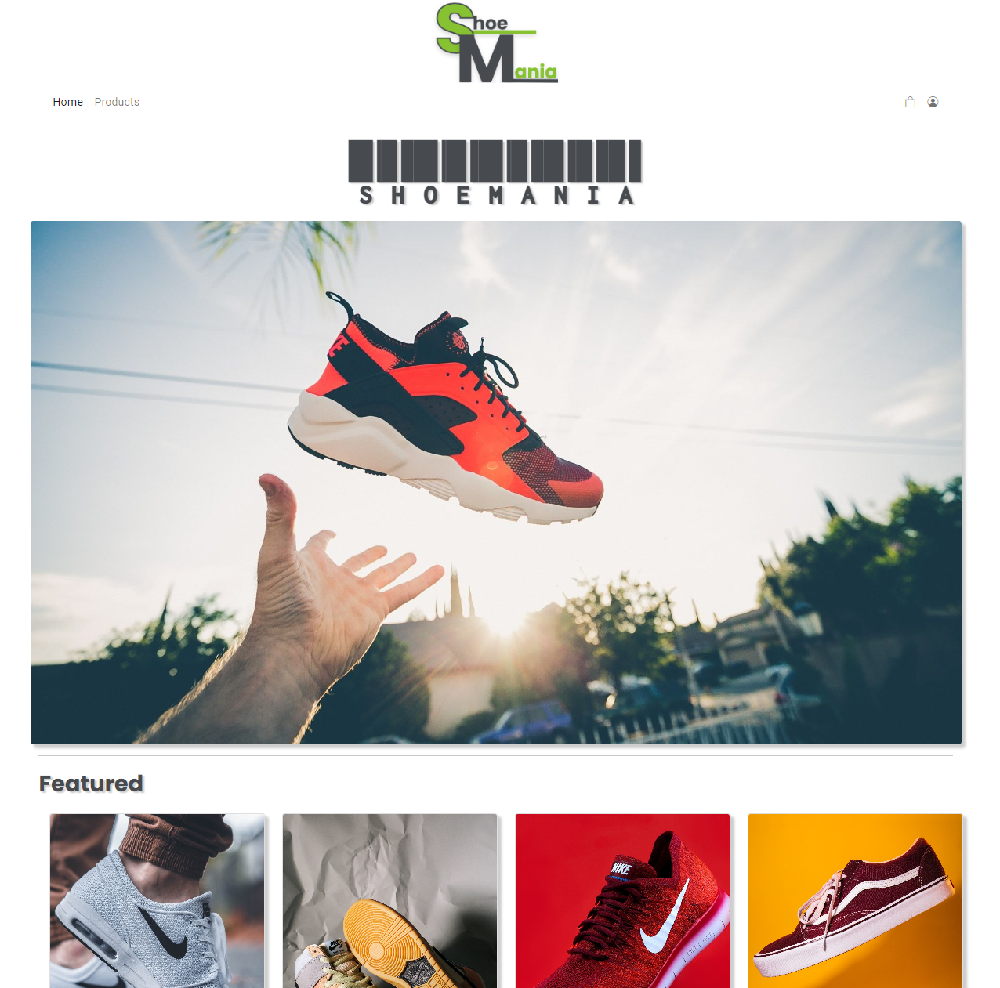

# ShoeManie | Semester Project 2 | Noroff

This is a Copy of my Semester Project 2 i did at Noroff. (The original project used a local API, this one has a live API)

## Description

We was tasked to build an e-commerce website. Theme for the website was my own to choose. 

The plan for this project is to rebuild it with React and continue adding products to the API so it will grow both in products and tech.

### Project requirements:

Home page

- Hero banner with an image that is uploaded to Strapi.
- A list of featured products.

Products page

- List of all products added to Strapi with a set given requirements to title, price, image ect..
- Search bar to filter productes by title or description

Details page
This page is reached by a user clicking on a prudct on the pruct list page.

- title, description, image, price
- an add to cart button, this will toggle the product in and out of a cart array stored in local storage.

Cart/Basket page

- List of product in your cart/basket
- total price of the products in the cart/basket
- delete items in the cart/basket
- message if there is no items/products in the cart/basket

There was no requirements to add a CHECKOUT/PAYMENT page on this project.

Admin Section (the biggest part of the project)

- Login/Logout to adminpage
- Usage of LocalStorage to keep the user logged in
- Add/edit products
- delete products

## Built With

You can list a the tech stack that you've used over here
- [HTML]
- [CSS]
- [JavaScript]
- [Sass](https://sass-lang)
- [Bootstrap](https://getbootstrap.com)
- [Strapi](https://docs.strapi.io/developer-docs/latest/getting-started/introduction.html)

## Getting Started

### Installing

There are no need to install anything to run this project. 

## Contact

Email:  hm.tomter@gmail.com

[My LinkedIn page](https://www.linkedin.com/in/harald-morten-tomter-6b7148204/)

